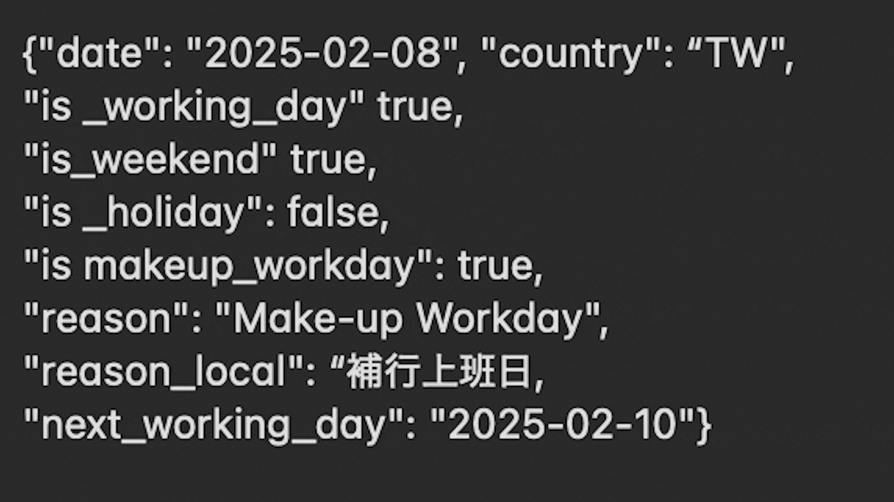

# Asia Business Day API (Japan/Taiwan)

🚀 **Available on RapidAPI:**  
https://rapidapi.com/s7ryo7/api/asia-business-day

> Most calendar APIs fail in Taiwan.

## Saturday... but still a workday.

Most holiday APIs treat all weekends as non-working days.

That breaks in Taiwan.

Taiwan has unique **makeup workdays (補班日)** where Saturdays become official business days.  
This API handles them correctly — along with Japanese substitute holidays and cross-border business day calculations.

Built for:

- Trading systems
- TSMC supply chains
- Logistics platforms
- Cross-border e-commerce
- Financial settlement systems

# Why this API exists

Most calendar APIs fail to handle:

- Taiwan makeup workdays (補班日)
- Japanese substitute holidays
- Business day math across East Asia
- Cross-border logistics calendars
- Trading settlement edge cases

This API was built specifically for East Asian operational accuracy.

## Description
The East Asia Precision Trading & Logistics Calendar API is the ultimate solution for calculating true business days in Japan (JP) and Taiwan (TW). Designed for algorithmic trading, cross-border logistics, and enterprise supply chain management, this API goes beyond simple weekend filtering. It flawlessly handles complex local calendar rules—including Japan's substitute holidays and Taiwan's unique "makeup workdays" (補班日)—ensuring 100% accurate business day logic for your applications.

## Key Features
- **Flawless Working Day Calculation:** Accurately skip weekends and national holidays to determine the exact next business day in East Asia.
- **Native "Makeup Workday" Support:** Automatically identifies Taiwan's special weekend working days (補行上班日) and treats them as valid business days, a critical feature missing in standard calendar APIs.
- **Business Day Math (add_days):** Easily calculate exact target dates (e.g., "3 working days from today") without writing complex date logic on your own server.
- **MEGA Plan Exclusive - Simultaneous Dual-Country Check:** Access our premium endpoint to fetch synchronized calendar data and next working day calculations for both Japan and Taiwan in a single, blazing-fast request.
- **Ultra-Low Latency:** Hosted on a stateless, enterprise-grade edge network with zero database queries, delivering lightning-fast responses globally.
- **Multilingual Context:** Returns holiday reasons and statuses in English, Japanese, and Traditional Chinese.

- ## OpenAPI

This API provides an OpenAPI 3.1 specification for developers, automation workflows, and AI agents.

- OpenAPI schema endpoint: https://east-asia-calendar-api.s7ryo7.workers.dev/openapi.yaml
- OpenAPI schema on GitHub: https://github.com/YOUR_USERNAME/YOUR_REPOSITORY/blob/main/openapi.yaml
- RapidAPI page: https://rapidapi.com/YOUR_USERNAME/api/asia-business-day

The schema is designed for structured JSON integration and GPT/Claude/Cursor-style tool calling workflows.

## Ideal Use Cases
- **TSMC & Semiconductor Supply Chain Trading:** Accurately align trading algorithms and financial models with the true operational calendars of TSMC, its Japanese facilities (e.g., Kumamoto), and related supply chain partners.
- **Cross-Border E-Commerce (EC):** Dynamically calculate hyper-accurate shipping estimates, delivery ETAs, and customer support availability for platforms operating between Japan and Taiwan.
- **Algorithmic Trading & Finance:** Precisely calculate settlement dates (T+1, T+2) and avoid executing trades on unexpected Asian bank holidays.
- **Logistics & Supply Chain:** Calculate exact delivery ETAs across borders by factoring in local non-working days, including Taiwan's unique "makeup workdays".
- **HR & Project Management:** Automate payroll, leave management, and precise project deadlines across Asian teams.

## Subscription Plans & Features
**🟢 BASIC (Free)**
Perfect for testing your integration and analyzing historical data.
- **Features:** Access to Single Date Check, Date Range, and Business Day Math (Calculate).
- **Limitation:** Restricted to **past dates only**. Future dates will return an error.

**🔵 PRO**
Designed for straightforward operational needs.
- **Future Dates Unlocked:** Fully access current and future calendar data.
- **Features:** Single Date Check (Check if a specific day is a working day, holiday, or makeup workday).
- *Note: Date Range and Business Day Math endpoints are disabled in this plan.*

**🟣 ULTRA**
Built for advanced trading algorithms and complex logistics systems.
- **Future Dates Unlocked:** Fully access current and future calendar data.
- **Features:** Single Date Check, Date Range, and **Business Day Math** (Easily calculate "N working days from today" without coding complex logic).

**🟠 MEGA**
The ultimate enterprise solution for seamless East Asian cross-border operations.
- **Features:** Includes all ULTRA features.
- **Premium Exclusive:** Unlocks the `Simultaneous Dual-Country Check` endpoint. Fetch synchronized calendar data and next working day calculations for both Japan and Taiwan in a single request, drastically reducing API calls and latency.

## Supported Date Range
This API provides extensive historical and future coverage, relying exclusively on official government releases:
- **Japan (JP):** 1955 to 2026
- **Taiwan (TW):** 2017 to 2026
*(Note: Future years are automatically added annually upon official publication by the respective governments.)*

## Data Reliability (100% Accurate & Deterministic)
Unlike AI-generated data, this API is deterministic and guarantees zero hallucination. It runs exclusively on official, up-to-date government data sources:
- **Japan:** Official holiday data from the Cabinet Office, Government of Japan.
- **Taiwan:** Official administrative calendar data from the Directorate-General of Personnel Administration (Taiwan).

